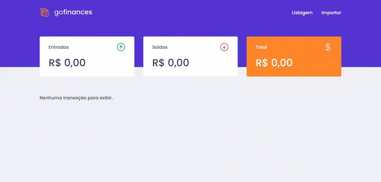

<h1 align="center">

</h1>

<p align="center">
 <a href="#sobre">Sobre</a> |
 <a href="#Requisitos">Requisitos</a> | 
 <a href="#Tecnologias">Tecnologias</a> | 
 <a href="#Como-executar">Como executar</a> | 
 <a href="#licenc-a">Licença</a> | 
</p>

<h1 align="center">
  
</h1>

## 🚀 Sobre
Este é um projeto desenvolvido para gerenciar as finanças do usuário, esse repositório contem um API REST em Node.js como back-end e uma aplicação em ReactJS como front-end utilizando TypeScript.

---
## 📚 Requisitos
- Ter [**Git**](https://git-scm.com/) para clonar o projeto.
- Ter [**Node.js**](https://nodejs.org/en/) instalado.
- Ter [**Docker**](https://www.docker.com/) rodando um container PostgreSQL ou o [**PostgreSQL**](https://www.postgresql.org/) instalado em sua máquina e configurado.

---
## 🚀 Tecnologias
### Back-end
- [Node.js](https://nodejs.org/en)
- [TypeScript](https://github.com/microsoft/TypeScript)
- [Express](https://github.com/expressjs/express)
- [TypeORM](https://github.com/typeorm/typeorm)
- [ESLint](https://github.com/eslint/eslint)
- [Prettier](https://github.com/prettier/prettier)

### Front-end
- [ReactJS](https://github.com/facebook/react)
- [TypeScript](https://github.com/microsoft/TypeScript)
- [styled-components](https://github.com/styled-components/styled-components)
- [axios](https://github.com/axios/axios)
- [ESLint](https://github.com/eslint/eslint)
- [Prettier](https://github.com/prettier/prettier)

---
## ⚙️ Como executar

```bash

    # Clonar o repositório
    $ git clone https://github.com/claudianopl/GoFinances.git

    # Navegar para o diretório
    $ cd GoFinances

```

### Executando o back-end
- No arquivo ormconfig.json configure os parâmetros de acesso ao banco de dados (username, password e database);

- No arquivo src/database/index.jsormconfig.json o nome do banco de dados dos testes (gofinances_tests);
```bash
    # Navegar para o diretório do back-end
    $ cd GoFinances/backend

     # instalar as dependências
    $ yarn

    # Executar migrations para criação das tabelas nas base de dados
    $ yarn typeorm migration:run

    # Iniciar o projeto
    $ yarn start

    # Iniciar o projeto em desenvolvimento
    $ yarn dev:server
   
    # Executar testes
    $ yarn test
```

### Executando o front-end

```bash
    # Navegar para o diretório do front-end
    $ cd GoFinances/frontend

     # instalar as dependências
    $ yarn

    # Iniciar o projeto
    $ yarn dev:server
   
    # Executar testes
    $ yarn test

    # Executar build
    $ yarn build
```

---
## 📝 Licença
Esse projeto está sob a licença MIT. Veja o arquivo [LICENSE](LICENSE.md) para mais detalhes.

---
Feito com 💜 by Claudiano Lima

<p align="right">
  
  &nbsp;&nbsp;&nbsp;&nbsp;&nbsp;&nbsp;
  
</p>
