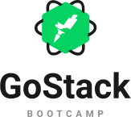

<h3 align="center">
  Desafio 06: Banco de dados e upload de arquivos no Node.js
</h3>

## 🚀 Sobre

Esta é uma aplicação feita em NodeJS, que permite criar, listar e deletar transações. É possível também criar transações à parter do upload de um arquivo, os arquivos devem possuir extensão csv, que se encontra na pasta de test.


## 🚀 Tecnologias
- Node.js
- TypeScript
- Express
- TypeORM
- ESLint
- Prettier


## ⚙️ Como executar

```bash

    # Clonar o repositório
    $ git clone https://github.com/claudianopl/GoFinances.git

    # Navegar para o diretório
    $ cd GoFinances/backend

```

- No arquivo ormconfig.json configure os parâmetros de acesso ao banco de dados (username, password e database);

- No arquivo src/database/index.jsormconfig.json o nome do banco de dados dos testes (gofinances_tests);
```bash
    # Instalar as dependências
    $ yarn

    # Executar migrations para criação das tabelas nas base de dados
    $ yarn typeorm migration:run

    # Iniciar o projeto
    $ yarn start

    # Iniciar o projeto em desenvolvimento
    $ yarn dev:server

    # Executar testes
    $ yarn test
```

## 📝 Licença
Esse projeto está sob a licença MIT. Veja o arquivo [LICENSE](LICENSE.md) para mais detalhes.

---
Feito com 💜 by Claudiano Lima

<p align="right">
  
  &nbsp;&nbsp;&nbsp;&nbsp;&nbsp;&nbsp;
  
</p>
